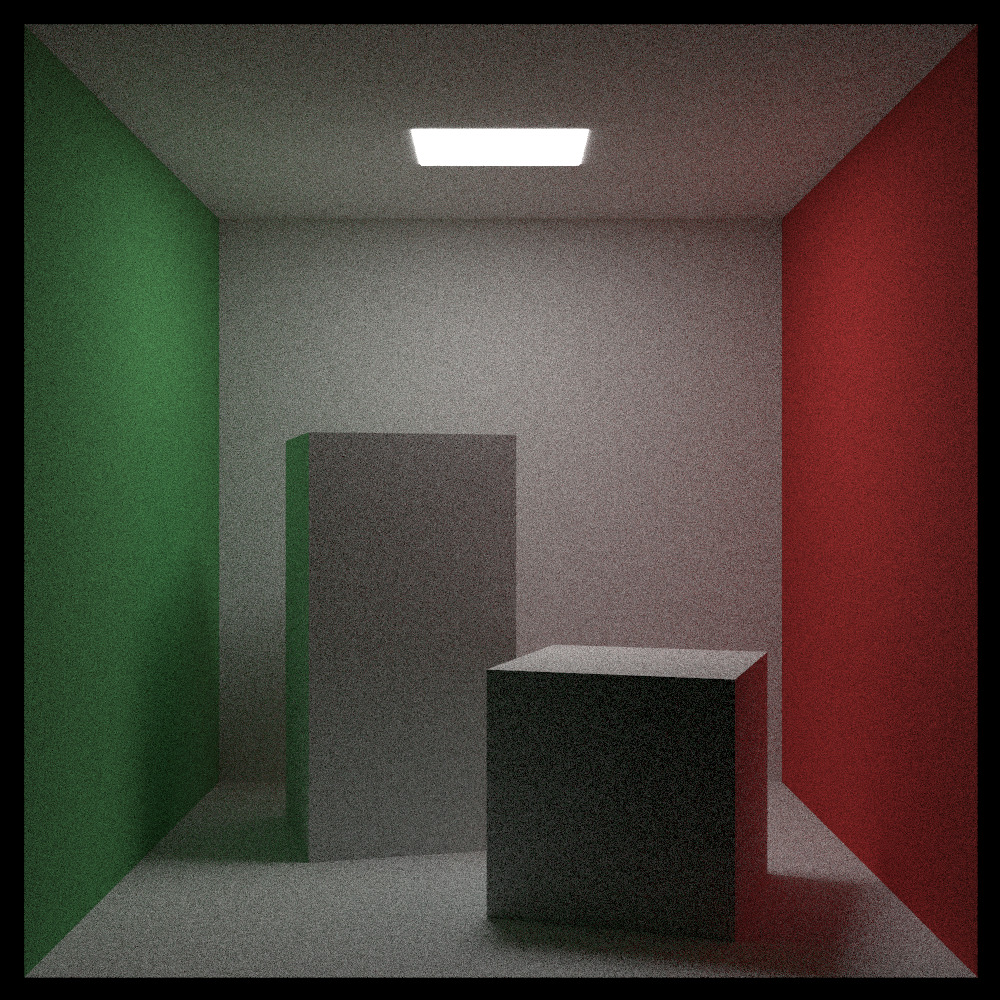
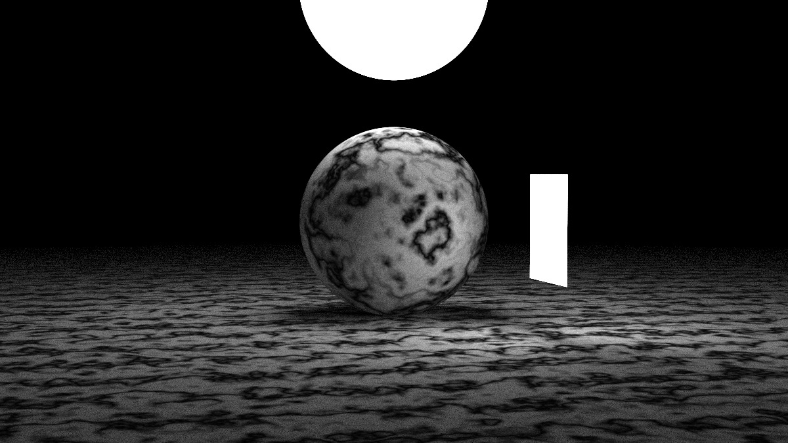

# Software RayTracer

I made this raytracer following the "Ray Tracing in One Weekend" series. I wanted to share what I made and hope you like it!

## Table of Contents

- [Features](#features)
- [Installation](#installation)
- [Usage](#usage)
- [Screenshots / Results](#screenshots--results)
- [Project Structure](#project-structure)
- [Contact](#contact)

## Features

- Texture mapping
- Value and Perlin noise textures
- Virtual camera
- BVH acceleration structure
- Export results to images

## Installation

Clone the repository and build the project:

```bash
git clone https://github.com/YassinRamadan1/Software-RayTracer.git
cd Software-RayTracer
```

## Usage

1. Create a `HittableList` and add primitives (spheres, quads, etc.) with their materials.
2. Construct a `Camera` and configure:
   - Aspect ratio, image width, samples per pixel, max depth
   - Camera attributes: `look_at`, `look_from`, `world_up`
3. Initialize the camera:
   ```cpp
   cam.init();
   cam.image_ = new TGAImage(cam.image_width_, cam.image_height_, TGAImage::RGB);
   ```
4. Render the scene:
   ```cpp
   cam.render(hittable_list);
   ```
   The output will be saved as `Export/image.tga`. To change the output path, set `cam.image_path_`.

## Screenshots / Results

Below are sample outputs generated by the raytracer (located in the `Export` folder):


*Many reflections and refractions simulated in this scene.*


*The famous Cornell box with area lighting.*


*Sphere with multiple layers of Perlin noise and area lighting.*

## Project Structure

```
src/           # Main raytracer source code
Export/        # Output images generated by the raytracer
res/           # Models to render
README.md      # This file
```

## Contact

For questions or feedback, please contact Yassin Ramadan (yassinramadan.dev@gmail.com).
